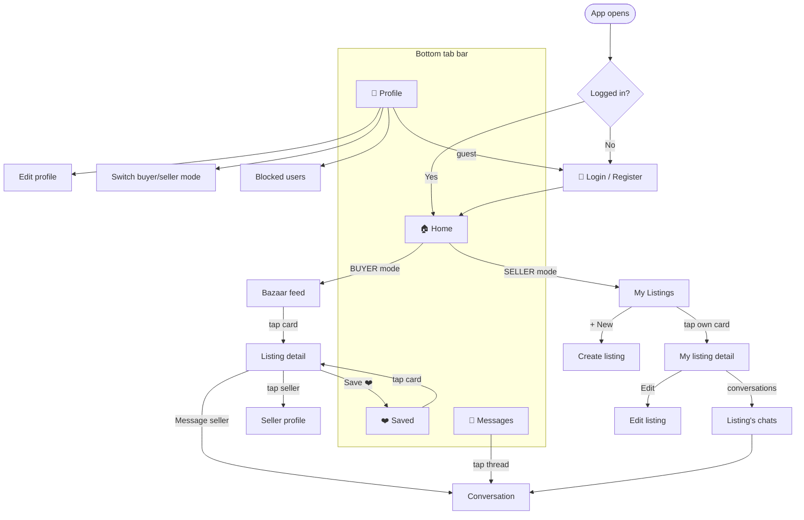

# 🧭 Hatiwal Mobile — Testing Guide & App Map

> For testing the app **without knowing the codebase**. It shows **every screen**, **where it lives in the code**, **which web page it mirrors**, **which backend feeds it**, and a **checklist to test everything**.
>
> Hatiwal is a **local marketplace for Afghanistan** — people buy and sell items, meet in person, and chat in-app. **No online payment, no delivery.** The mobile app and the **hatiwal-web** site are two clients of the **same Rails API**: same data, same logins, same listings — just a native phone UI here.
>
> One account is **both buyer and seller**. A **mode toggle** (in Profile) flips several screens between buying and selling.

---

## 1. How to launch & connect

1. **Phone & computer on the same network** (same WiFi, or the computer on your phone's hotspot).
2. Start the dev server: `npx expo start` (or `HOST_IP=<lan-ip> docker compose up mobile`).
3. Open **Expo Go** on your phone → scan the QR code. It connects to Metro at `exp://<computer-ip>:3008`.
4. The phone must reach Metro **and** the Rails API at the computer's **real LAN IP** — not `localhost`. That's what `HOST_IP` / the `.env` `EXPO_PUBLIC_API_URL` is for. If you switch WiFi ↔ hotspot, tell Claude → it flips `.env` to the new IP.
5. **To reload after a code change:** shake the phone → **Reload** (or it auto-refreshes).

**Backend must be running:** `hatiwal-api` on `:3007` (REST) and `:3098` (chat WebSocket).

### Logged in vs Guest
- You can browse, search, filter, and open detail pages **as a Guest**.
- **Login is needed for:** save/favorite ❤️, messaging a seller 💬, creating/editing listings, profile, blocking, reporting.
- As a Guest, tapping a gated action (Save, Message) → redirects to login, then **resumes the action** after you sign in.

### Demo logins (seeded)
| Role | Email | Password |
|---|---|---|
| Buyer **and** Seller | `buyer@hatiwal.test` | `Password123!` |
| Seller (has draft/active/reserved/sold) | `seller@hatiwal.test` | `Password123!` |
| Fresh buyer | `newbuyer@hatiwal.test` | `Password123!` |

Seed/reset the data: `cd hatiwal-api && bundle exec rails db:seed:e2e` (or `db:seed:reset_e2e`).

---

## 2. Navigation map (diagram)

This is a **Mermaid** diagram — it renders as a real flowchart in VS Code (Markdown Preview) or GitHub. The plain tree underneath says the same thing for the terminal.



### Plain tree (same thing)

```
App opens → (login if guest) → Home
│
├── 🏠 HOME  (dual mode — flips with the Profile toggle)
│      ├── BUYER  → Bazaar feed → tap card → Listing detail
│      │                                   ├─ Message seller → Conversation
│      │                                   ├─ tap seller     → Seller profile
│      │                                   └─ Save ❤️         → Saved
│      └── SELLER → My Listings  → + New        → Create listing
│                                → tap own card → My listing detail → Edit listing
│                                                                   → Listing's chats → Conversation
│
├── ❤️ SAVED   (buyer mode) → tap card → Listing detail
│
├── 💬 MESSAGES → tap thread → Conversation (live chat)
│
└── 👤 PROFILE  → Edit profile · Switch buyer/seller mode · Blocked users  (Login if guest)
```

---

## 3. Page-by-page map — *which screen comes from where*

Every screen you can reach: the **route file**, the **screen file**, the **web page it mirrors**, and the **backend** it uses.

> **Backend:** there's **one Rails API**. 🟦 **REST** = normal request/response (listings, profiles, saves, reports). 🟩 **Cable** = live WebSocket (chat messages arriving in real time). Chat screens use **both**.

| # | Screen (what you see) | How to reach it | Code: route file | Code: screen | Web page it mirrors | Backend |
|---|---|---|---|---|---|---|
| 1 | **Login** | app start (guest) / Profile tab | `app/(auth)/login.tsx` | `src/screens/shared/Login.tsx` | `/login` | 🟦 |
| 2 | **Register** | Login → Sign up | `app/(auth)/register.tsx` | `src/screens/shared/Register.tsx` | `/signup` | 🟦 |
| 3 | **Home — Bazaar** (buyer mode) | Home tab, buyer mode | `app/(main)/(tabs)/browse.tsx` | `src/screens/buyer/Browse.tsx` | `/bazaar` | 🟦 |
| 4 | **Home — My Listings** (seller mode) | Home tab, seller mode | `app/(main)/(tabs)/browse.tsx` → `my-listings.tsx` | `src/screens/seller/MyListings.tsx` | `/my-listings` | 🟦 |
| 5 | **Saved** ❤️ | Saved tab (buyer) | `app/(main)/(tabs)/saved.tsx` | `src/screens/buyer/Saved.tsx` | `/saved` | 🟦 |
| 6 | **Messages** (inbox) | Messages tab | `app/(main)/(tabs)/chat.tsx` | `src/screens/chat/Conversations.tsx` | `/conversations` | 🟦🟩 |
| 7 | **Profile** | Profile tab | `app/(main)/(tabs)/profile.tsx` | `src/screens/shared/Profile.tsx` | `/profile` | 🟦 |
| 8 | **Listing detail** (buyer view) | tap any listing card | `app/(main)/listing/[id].tsx` | `src/screens/shared/ListingDetail.tsx` | `/listings/[id]` | 🟦 |
| 9 | **Create listing** | My Listings → + New | `app/(main)/listing/new.tsx` | `src/screens/seller/ListingForm.tsx` | `/listings/new` | 🟦 |
| 10 | **Edit listing** | My listing detail → Edit | `app/(main)/listing/edit/[id].tsx` | `src/screens/seller/ListingForm.tsx` | `/listings/[id]/edit` | 🟦 |
| 11 | **My listing detail** (seller view) | My Listings → tap own card | `app/(main)/my-listings/[id].tsx` | `src/screens/seller/MyListingDetail.tsx` | `/my-listings/[id]` | 🟦 |
| 12 | **Listing's conversations** (seller) | My listing detail → chats | `app/(main)/listing-conversations/[id].tsx` | (in chat screens) | `/conversations?listing=[id]` | 🟦🟩 |
| 13 | **Conversation** (thread) | inbox / listing → open chat | `app/(main)/conversation/[id].tsx` | `src/screens/chat/Conversation.tsx` | `/conversations/[id]` | 🟦🟩 |
| 14 | **Seller profile** | tap a seller on a listing | `app/(main)/seller/[userId].tsx` | `src/screens/shared/UserProfile.tsx` | `/sellers/[id]` | 🟦 |
| 15 | **User profile** | tap a user | `app/(main)/user/[id].tsx` | `src/screens/shared/UserProfile.tsx` | `/sellers/[id]` (web canonicalizes) | 🟦 |
| 16 | **Edit profile** | Profile → Edit | `app/(main)/profile/edit.tsx` | `src/screens/shared/EditProfile.tsx` | `/profile/edit` | 🟦 |
| 17 | **Blocked users** | Profile → Blocked users | `app/(main)/blocked-users.tsx` | `src/screens/shared/BlockedUsers.tsx` | `/settings/blocked-users` | 🟦 |

> **Web-only pages** (no standalone mobile screen — on mobile these live as filters/sheets inside Bazaar): `/categories`, `/categories/[slug]`. **Mobile-only:** the per-listing seller chat list (#12) is a dedicated screen on mobile; web folds it into `/conversations?listing=`.

### Key API modules (which file talks to the backend)
`src/api/` → `auth.ts` · `listings.ts` · `conversations.ts` · `users.ts` · `categories.ts` · `reports.ts` · `saved-searches.ts` · `warnings.ts` · `http.ts` (Axios client). Live chat uses `src/hooks/useCableChannel.ts` / `useConversationCable.ts`.

---

## 4. Test checklist — *test everything*

Tick as you go. ⭐ = the core path; 🔒 = needs login; 🌐 = check it matches the web app too.

### 🔐 Auth
- [ ] ⭐ Register a new account → lands logged in
- [ ] ⭐ Login with `buyer@hatiwal.test` → home loads
- [ ] Logout (Profile) → returns to guest; tabs adjust (Saved hidden)
- [ ] Guest taps Save/Message → redirected to login → action completes after sign-in
- [ ] 🌐 An account created on web logs in here with the same data

### 🏠 Home — Buyer (Bazaar)
- [ ] ⭐ Feed loads with listing cards (photo, price, title, location)
- [ ] Search filters results
- [ ] Filters (category, price, condition, province) work; sort changes order
- [ ] Scroll down → more listings load (pagination)
- [ ] List ↔ grid view toggle works
- [ ] Empty search → friendly empty state

### 🏪 Home — Seller (My Listings)
- [ ] ⭐ Switch to Seller mode (Profile) → Home becomes My Listings
- [ ] ⭐ **+ New** → create a listing (title, price, category, province, photos) → it appears
- [ ] Status badges show: draft / active / reserved / sold
- [ ] Tap own card → My listing detail → **Edit** saves changes
- [ ] Mark reserved / sold / re-activate
- [ ] Delete a listing (confirm dialog appears first)

### 📄 Listing detail
- [ ] ⭐ Opens with photo gallery (swipe), price prominent, seller identity, location
- [ ] 🔒 ❤️ Save toggle (prompts login as Guest)
- [ ] 🔒 💬 Message seller → opens a conversation / first-message sheet
- [ ] Make an offer sheet works (if shown)
- [ ] Tap seller → Seller profile (their other active listings)
- [ ] Report listing (🔒) submits

### 💬 Messages & chat (🔒)
- [ ] Inbox lists conversations; unread badge on the tab
- [ ] ⭐ Open a thread → send a message → it appears instantly
- [ ] 🌐 Reply from the web app → message arrives **live** here (Cable)
- [ ] Propose a meetup (sheet) works
- [ ] Seller: open a listing's conversations list
- [ ] Block a user → their messages stop; they appear in Blocked users

### 👤 Profile (🔒)
- [ ] Profile shows your name, avatar, stats
- [ ] Edit profile saves (name, avatar, phone, location)
- [ ] Buyer/seller mode toggle changes Home + visible tabs
- [ ] Blocked users list; unblock works

### 🌍 Cross-cutting
- [ ] Bottom tabs always visible; active tab highlighted, inactive readable
- [ ] Colors look right in **light** and **dark** mode (toggle in Profile)
- [ ] Switch language to **پښتو** / **دری** → text translates **and layout flips RTL**
- [ ] Every pushed screen has a working **back button**
- [ ] No red error screens

---

## 5. The backend (so errors make sense)

There's **one Rails API** (`hatiwal-api`) shared with the web app. Two channels:

| | 🟦 REST (`:3007/api/v1`) | 🟩 Cable / WebSocket (`:3098`) |
|---|---|---|
| Carries | listings, categories, profiles, saves, reports, sending a message | **live** message delivery, read receipts |
| If it fails | a list/detail shows an error or empty state; create/save fails | messages send but **don't appear live** until you re-open the thread |

So: if a **catalog/profile** page breaks → REST/API issue. If chat works but **new messages don't pop in live** → the Cable connection (`:3098` / `EXPO_PUBLIC_CABLE_URL`). If **personal** features (save, profile, my listings) fail → usually login/token.

Because mobile and web share this one API, **data created on either must work on the other** — that's worth spot-checking (the 🌐 items above).

---

## 6. If something looks broken — tell Claude

Say **which screen** (use the names/numbers in section 3) and **what you saw** (error text, blank area, wrong colors, no back button). The map above lets Claude jump straight to the file. Example: *"Listing detail → photo gallery won't swipe"* → that's `src/screens/shared/listing-detail/ListingGallery.tsx`.

---

## 7. Automated tests (for when you do know the codebase)

Three layers — every feature needs all three. Full spec: `docs/TESTING.md`.

| Layer | Tool | Where | Run |
|---|---|---|---|
| E2E | Maestro | `maestro/<area>/*.yaml` | `maestro test maestro/` (or one file/folder) |
| Unit | Jest + RNTL + MSW | `src/**/__tests__/` | `npm test` · `npm run test:coverage` |
| Visual | Storybook | `*.stories.tsx` beside component | `npm run storybook` |

Before shipping: `npm run test:coverage` ✅ · `maestro test maestro/` ✅ · visual pass on changed components · `npm run lint`.
